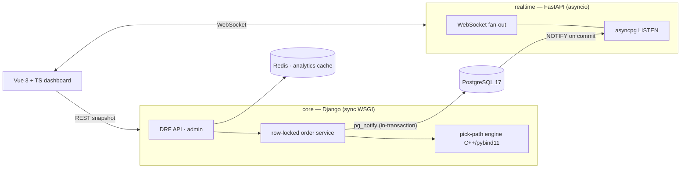

# Real-time Order & Inventory Operations Platform

[](https://github.com/OWNER/realtime-orders-platform/actions/workflows/ci.yml)
[](LICENSE)


A small but architecturally honest e-commerce backend that solves the two
problems toy CRUD tutorials skip:

1. **Concurrency correctness** — many orders decrementing the same stock at
   once, made safe with `SELECT ... FOR UPDATE` row locks acquired in a
   deadlock-free global order, and *proven* safe by tests that fire genuinely
   simultaneous transactions.
2. **Live updates without polling** — order/stock events delivered to browser
   dashboards over WebSockets, fed by PostgreSQL `LISTEN/NOTIFY` so an event
   can never exist for a rolled-back transaction.

Plus a third, quieter one: a CPU-bound warehouse **pick-path optimiser
written twice** — a pure-Python reference and a C++ (pybind11) engine proven
behaviourally identical by an exact-parity test suite.

## Architecture



Why two services: Django's synchronous worker model is right for
transactional business logic and wrong for thousands of idle WebSockets; an
asyncio event loop is the reverse. The realtime service runs no queries and
holds no state, so it scales horizontally with zero coordination.
Full reasoning: [docs/architecture.md](docs/architecture.md) and the
[ADRs](docs/adr).

## The interesting parts

### 1. Overselling is impossible by construction

Every stock mutation goes through one service function that locks the rows it
will touch — always in primary-key order, so two transactions can never hold
pieces of each other's lock set (no lock-ordering deadlocks):

```python
locked = list(
    Stock.objects.select_for_update(of=("self",))
    .filter(warehouse=warehouse, variant_id__in=variant_ids)
    .order_by("pk")           # global lock order → deadlock-free
)
# availability is checked *under the lock*; any shortage rolls back all of it
```

And the test that makes it an interview anecdote — eight threads, five units,
a barrier so they hit PostgreSQL together:

```python
results = run_in_threads([buy] * 8)
assert sum(1 for r in results if r[0] == "ok") == 5          # exactly five
assert sum(1 for r in results if r[0] == "insufficient") == 3
assert Stock.objects.get(variant=variant).quantity == 0      # never negative
```

Two more concurrency tests pin the deadlock-freedom claim (opposite item
orderings, repeatedly) and unit conservation when cancellations race
placements ([tests/test_concurrency.py](services/core/tests/test_concurrency.py)).

### 2. Events that cannot lie

`pg_notify()` is called on the same connection, inside the same transaction
as the stock change. PostgreSQL delivers notifications only on commit — so
the realtime service can never broadcast an order that was rolled back, with
no outbox machinery and no dual-write race. There is a test for the negative
case too: a rolled-back oversell emits *nothing*
([tests/test_notify.py](services/core/tests/test_notify.py)).
Trade-offs versus Redis pub/sub: [ADR 0002](docs/adr/0002-postgres-listen-notify-for-events.md).

### 3. C++ where CPU time is real, with a provably-equal fallback

Pick-path optimisation (nearest-neighbour + 2-opt over the warehouse grid's
Manhattan metric) is an O(n²)-per-pass pure-CPU loop on the request path.
The C++ engine releases the GIL while it runs; the pure-Python twin keeps
every environment working. Both are deterministic with identical
tie-breaking, so 150 randomized parity tests assert **exact** sequence
equality, and a Held–Karp exact solver bounds solution quality on small
instances.

<!-- BENCH-TABLE -->

Reproduce with `make bench` (also printed in every CI run's job summary).

### 4. A query worth explaining

"Top-selling products per warehouse in the last 24 hours" — three joins, a
grouped aggregation and a per-warehouse `RANK()` window, supported by a
**partial covering index** (`created_at WHERE status <> 'CANCELLED' INCLUDE
(warehouse_id, id)`). The repo includes a management command that measures
the plan with and without the index by dropping it inside a rolled-back
transaction. Measured on 240k orders with a 24h window matching 0.09% of
history:

| Variant | Plan | Execution time |
|---|---|---:|
| With index | **Index Only Scan** (Heap Fetches: 0) → Nested Loop via FK index | **4.08 ms** |
| Without index | Parallel Seq Scan over 240k rows | 104.98 ms (**25.7× slower**) |

The doc tells the whole story, including the first index design that the
planner rightly **ignored** (it didn't cover the join key) and the
selectivity regime where a seq scan legitimately wins — full plans and
reasoning: [docs/query-optimization.md](docs/query-optimization.md).

## Quickstart

```bash
git clone https://github.com/OWNER/realtime-orders-platform.git
cd realtime-orders-platform
cp .env.example .env

docker compose up -d --build                              # db, redis, core, realtime
docker compose run --rm core python manage.py seed_data   # catalogue + 6k orders
docker compose --profile ui up -d                         # Vue dev server

# live traffic for the dashboard (Ctrl+C to stop):
docker compose run --rm core python manage.py demo_orders
```

| URL | What |
|---|---|
| http://localhost:5173 | Live dashboard (orders, stock, pick paths, top sellers) |
| http://localhost:8000/api/ | Browsable DRF API |
| http://localhost:8000/admin/ | Django admin (`admin` / password from `.env`) |
| http://localhost:8001/healthz | Realtime service health (listener state, clients, drops) |

Press **"Simulate order"** in the dashboard header and watch the order feed,
stock bars and pick path react in real time. Everything shuts down with
`docker compose down`.

No Docker? The fast unit suite runs anywhere:
`cd services/core && USE_SQLITE=1 pytest -m "not integration"` — the
PostgreSQL-dependent tests skip themselves explicitly rather than pass
vacuously on SQLite.

## Testing

| Suite | What it proves | Where it runs |
|---|---|---|
| Core unit tests | order maths, lifecycle rules, API contracts, rollback semantics | anywhere (SQLite ok) |
| **Concurrency tests** | no oversell under racing buyers; deadlock-freedom; unit conservation | PostgreSQL (Compose/CI) |
| LISTEN/NOTIFY integration | events exactly-on-commit, nothing on rollback | PostgreSQL (Compose/CI) |
| Realtime tests | fan-out, per-order filtering, slow-consumer shedding, heartbeats, health | anywhere + PG for e2e |
| Pickpath tests | reference correctness vs exact oracle; **C++ ↔ Python exact parity** | anywhere; parity where built |
| Frontend | store reducers (vitest), strict `vue-tsc`, production build | anywhere |

CI runs all of it on every push — including compiling the C++ engine and
running the concurrency tests against a real PostgreSQL service container.

## Project structure

```
├── services/
│   ├── core/               # Django: catalog, inventory, orders, analytics
│   │   ├── orders/services.py   # the locking protocol lives here
│   │   ├── orders/events.py     # transactional pg_notify emission
│   │   └── tests/               # incl. test_concurrency.py, test_notify.py
│   └── realtime/           # FastAPI WebSocket gateway (asyncpg LISTEN)
├── native/
│   ├── pickpath/           # pure-Python reference implementation + oracle tests
│   └── pickpath-native/    # C++17 engine (pybind11, scikit-build-core)
├── frontend/               # Vue 3 + TypeScript + Pinia dashboard
├── deploy/                 # nginx config for the production layout
├── docs/                   # architecture, ADRs, query optimization, AWS runbook
└── .github/workflows/      # ci.yml (lint→test→build→GHCR), deploy.yml (EC2)
```

## CI/CD & deployment

Every push: **ruff → pytest (core, on Postgres+Redis service containers) →
pytest (realtime, on Postgres) → C++ build + parity + benchmark → mypy →
vue-tsc + vitest + build → three production Docker images**, pushed to GitHub
Container Registry on `main`.

Deployment targets a single EC2 instance via `docker-compose.prod.yml`
(nginx serving the SPA and terminating `/api` + `/ws`), with an optional S3
artifact sync. The workflow is deliberately **dormant until AWS secrets are
added**, so the whole pipeline is demonstrable at £0 standing cost — see
[docs/deployment-aws.md](docs/deployment-aws.md) and
[ADR 0004](docs/adr/0004-zero-cost-deploy-ready-posture.md). Kubernetes is
deliberately absent; the images are standard OCI artifacts so the EKS path
stays open.

## Tech stack — and why each piece is here

| Tech | Honest justification |
|---|---|
| Django 5.2 + DRF | transactional business core: ORM, migrations, admin, `select_for_update` |
| PostgreSQL 17 | row-level locking semantics the whole design rests on; LISTEN/NOTIFY as a transactional event channel |
| FastAPI + asyncpg | an event loop is the right shape for thousands of idle WebSockets; WSGI is not |
| Redis 7 | caches the hot analytics aggregation (30s TTL); *not* used for events — see ADR 0002 |
| C++17 + pybind11 | CPU-bound optimisation inner loop; GIL released during compute |
| Vue 3 + TypeScript + Pinia | snapshot-then-deltas dashboard with typed WebSocket contracts |
| Docker + Compose | one-command reproducible stack, dev and prod-shaped variants |
| GitHub Actions + GHCR | full pipeline on the free tier; images tagged `latest` + SHA |
| pytest | unit, integration and true concurrency tests as first-class citizens |

## Author

**Ariyan Mohammed Tipu** — BSc Mathematics with Data Science, City,
University of London; MSc Data Science, King's College London (2026–).

📧 ariyantipu39@gmail.com · [GitHub](https://github.com/OWNER)

## License

[MIT](LICENSE)
