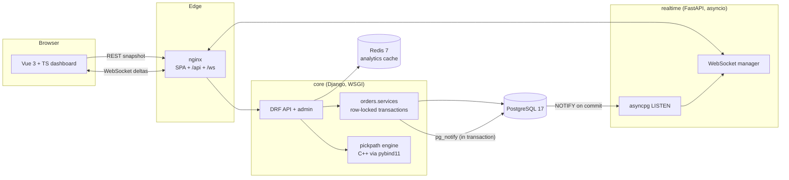

# Architecture

Two small services with sharply different jobs, one database that is also
the event bus, and a native extension where CPU time actually matters.

## Write path: placing an order

1. `POST /api/orders/` validates SKUs and resolves them to variants.
2. `orders.services.place_order` opens one transaction and takes
   `SELECT ... FOR UPDATE` on the stock rows, ordered by primary key.
   `of=("self",)` keeps the joined variant rows unlocked.
3. Availability is checked under the lock. Any shortage raises
   `InsufficientStock`, the transaction rolls back untouched, and the API
   returns 409 with per-SKU shortage details.
4. Otherwise: decrement stock, create the order, its items (with price
   snapshots) and the audit event, then call `pg_notify()` with the order
   and stock payloads on the same connection, still inside the transaction.
5. Commit. PostgreSQL only now delivers the notifications.

### Why pk-ordered locking matters

Two concurrent orders for item sets {A, B} and {B, A} would lock rows in
request order under a naive implementation, which is the textbook
lock-ordering deadlock. Sorting every lock acquisition by primary key gives
all transactions one global acquisition order, so cycles cannot form. The
test `test_opposite_item_orderings_do_not_deadlock` runs exactly that
interleaving.

### Locking hierarchy

Status transitions lock the order row first, then (for cancellation
restock) stock rows in pk order. Order first, then stock, never the
reverse, so the two lock classes cannot form a cycle either.

## Read path: the live dashboard

- On load, the dashboard fetches a REST snapshot (recent orders, stock
  levels) and opens one WebSocket to `/ws/dashboard`.
- The realtime service holds a single asyncpg connection LISTENing on
  `order_events` and `stock_events` and fans messages out to every
  connected client. Per-client queues are bounded: a slow consumer sheds
  its oldest messages (the dashboard wants the freshest state) and the drop
  count is exposed at `/healthz`.
- Reconnects: the browser backs off exponentially (1s to a 30s cap) and
  re-hydrates the snapshot on reconnect; the listener side does the same
  towards PostgreSQL. Both sides therefore recover from restarts of
  anything without help.

## Failure modes, deliberately handled

| Failure | Behaviour |
|---|---|
| Oversell race | Impossible by construction (row locks); the DB CHECK `quantity >= 0` is defence in depth |
| Transaction rolls back after emitting an event | Cannot happen; NOTIFY is transactional with the write |
| Realtime service down | Orders unaffected; dashboards reconnect and re-hydrate; missed events are absorbed by the snapshot |
| PostgreSQL restart | The listener reconnects with capped backoff; `/healthz` reports degraded meanwhile |
| Slow or stuck dashboard tab | Its queue sheds oldest messages; other clients are unaffected |
| Duplicate SKUs in one request | Merged at the API boundary; the service layer rejects duplicates outright |

## Scaling story (the interview version)

- **core** scales by adding gunicorn workers or replicas. It is stateless
  between requests; all coordination lives in PostgreSQL row locks.
- **realtime** scales by adding replicas. Each keeps its own LISTEN
  connection and serves its own clients; there is no shared state and no
  coordination.
- The single writer database is the honest bottleneck. The next steps at
  real scale (read replicas for the dashboard snapshot, an outbox plus a
  broker for events, per-warehouse partitioning) are documented trade-offs
  in ADR 0002, not accidents.
